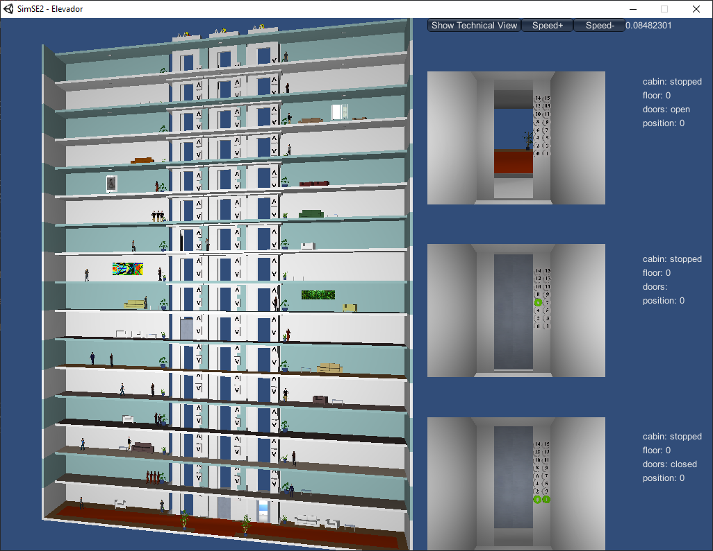

# TM4C1294 Elevator Control

Controls a 3 elevator/lift system on Texas Instruments TM4C1294 Cortex-M4 board using Keil RTX5 RTOS.

Connects via Serial port with a simulator running on the host computer.

## Simulator

On the elevator simulator folder ([elevator_sim](./elevator_sim)) you can find an
.exe to run the simulator on Windows. This simulator was given to me on my Embedded
Systems course at UTFPR

The specification for the protocol is on [simulator_spec.pdf (Portuguese)](./docs/simulator_spec.pdf)

For testing the simulator locally without a microcontroller, you must create a virtual
serial port using https://freevirtualserialports.com/. Configure it in **local bridge**
mode:

- **First Port Name**: COM1 (or other COM port, if COM1 is already used)
- **Second Port Name**: COM2 (or other COM port, if COM2 is already used)

This will redirect all traffic to COM1 to COM2.

Then, select the **elevator_sim** folder and run the simulator.

On the simulator initial screen, select the target port as the First Port Name (COM1).
The baud rate should be 115200.

Then, open your preferred serial terminal and connect to the Second Port Name (COM2).

Every command you send to the simulator will be sent to the serial port according to the
protocol described on [simulator_spec.pdf (Portuguese)](./docs/simulator_spec.pdf).
