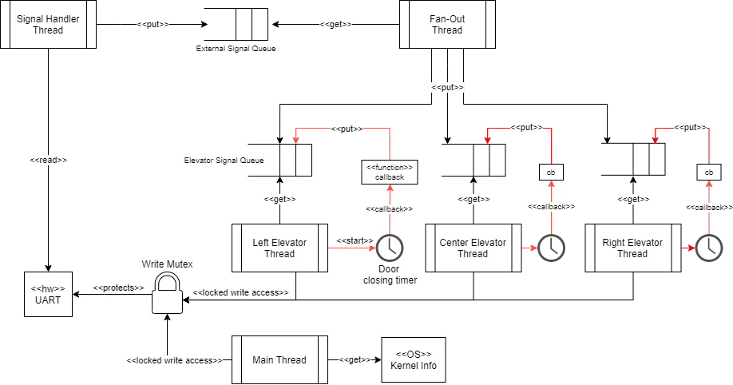
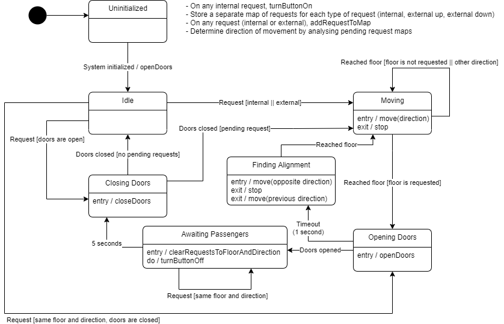

# TM4C1294 Elevator Control

Controls a 3 elevator/lift system on Texas Instruments TM4C1294 Cortex-M4 board using Keil RTX5 RTOS.

Connects via Serial port with a simulator running on the host computer.

## Running the project

First, you need to [install IAR IDE version 9](https://www.iar.com/products/architectures/arm/iar-embedded-workbench-for-arm/).
You can download the trial version.

- Make sure you install all the `TI - Texas Instruments` drivers, such as `TI ICDI`.
- Clone this repository
- Open the `.eww` workspace in IAR
- Set the active project as `elevator_control`
- On the project settings, make sure the `Debugger` -> `Driver` option is set to `TI Stellaris`
- Build the project in Debug mode and run it 🚀

## Functional Requirements

The functional requirements are described in Portuguese here: [Requisitos](./requisitos)

## Architecture

### Block diagram

### State machine diagrams

[Other diagrams](./detalhado)

## Simulator

On the elevator simulator folder ([elevator_sim](./elevator_sim)) you can find an
.exe to run the simulator on Windows. This simulator was given to me on my Embedded
Systems course at [UTFPR](https://utfpr.edu.br/)

The specification for the protocol is on [simulator_spec.pdf (Portuguese)](./docs/simulator_spec.pdf)

For testing the simulator locally without a microcontroller, you must create a virtual
serial port using https://freevirtualserialports.com/. Configure it in **local bridge**
mode:

- **First Port Name**: COM1 (or other COM port, if COM1 is already used)
- **Second Port Name**: COM2 (or other COM port, if COM2 is already used)

This will redirect all traffic to COM1 to COM2.

Then, select the **elevator_sim** folder and run the simulator.

On the simulator initial screen, select the target port as the First Port Name (COM1).
The baud rate should be 115200.

Then, open your preferred serial terminal and connect to the Second Port Name (COM2).

Every command you send to the simulator will be sent to the serial port according to the
protocol described on [simulator_spec.pdf (Portuguese)](./docs/simulator_spec.pdf).
